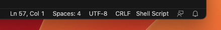
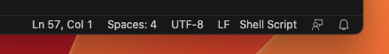

# CNS-OIST STEPS Docker Image

This repository provides both the Docker recipe and runtime configuration
of the official
[CNS-OIST STEPS Docker image](https://hub.docker.com/repository/docker/cnsoist/steps).

## Requirements

You must have:
* [Docker](https://www.docker.com/community-edition) installed and running.
* [Docker Compose](https://docs.docker.com/compose) utility installed.
* [Git](https://git-scm.com/)

## Getting Started (MacOS & Linux)

The set of commands below will start a JupyterLab container providing
STEPS Python module.

```bash
$ git clone https://github.com/CNS-OIST/STEPS_Docker
$ cd STEPS_Docker
$ echo "DUID=$(($(id -u)+1))\nDGID=$(id -g)\nHOST=$(hostname)" > .env
$ docker-compose build
$ docker-compose up
Creating network "stepsdocker_default" with the default driver
Creating stepsdocker_lab_1 ...
Creating stepsdocker_lab_1 ... done
Attaching to stepsdocker_lab_1
lab_1       | [I 11:11:08.510 LabApp] Writing notebook server cookie secret to /home/dummy/.local/share/jupyter/runtime/notebook_cookie_secret
lab_1       | [W 11:11:08.526 LabApp] JupyterLab server extension not enabled, manually loading...
lab_1       | [I 11:11:08.526 LabApp] JupyterLab alpha preview extension loaded from /opt/conda/lib/python2.7/site-packages/jupyterlab
lab_1       | JupyterLab v0.27.0
lab_1       | Known labextensions:
lab_1       | [I 11:11:08.527 LabApp] Running the core application with no additional extensions or settings
lab_1       | [I 11:11:08.528 LabApp] Serving notebooks from local directory: /opt/src/notebooks
lab_1       | [I 11:11:08.528 LabApp] 0 active kernels
lab_1       | [I 11:11:08.528 LabApp] The Jupyter Notebook is running at:
lab_1       | [I 11:11:08.528 LabApp] http://0.0.0.0:8888/?token=1ad5c8449f01f463bb9f716663e14f38cc133517c097ff9b
lab_1       | [I 11:11:08.528 LabApp] Use Control-C to stop this server and shut down all kernels (twice to skip confirmation).
lab_1       | [C 11:11:08.529 LabApp]
lab_1       |
lab_1       |     Copy/paste this URL into your browser when you connect for the first time,
lab_1       |     to login with a token:
lab_1       |         http://0.0.0.0:8888/?token=1ad5c8449f01f463bb9f716663e14f38cc133517c097ff9b

```

Then open your web browser at the provided HTTP address. In this case
http://0.0.0.0:8888/?token=1ad5c8449f01f463bb9f716663e14f38cc133517c097ff9b

## Files management

Inside the JupyterLab files browser, you will be able to see `STEPS_Example` directory
providing code samples to start with.

You are free to modify the `notebooks` directory from either the container or
your machine. Files created on one side will be visible on the other one, and vice versa!

## Advanced Usage

### Use a previous version of STEPS

By default, this repository use the latest stable of STEPS but you can choose to use a specific one. There are git tags for every versions of STEPS. To list them use the `git tag` command. Then:

```bash
$ git checkout TAG
$ echo "DUID=$(($(id -u)+1))\nDGID=$(id -g)\nHOST=$(hostname)" > .env
$ docker-compose up lab
```

### Execute custom command in the container

To execute a custom command in the container, you can use the command below:

```bash
$ docker-compose run steps COMMAND
```

`COMMAND` can be anything like `bash` or `ipython`.

### Run huge simulations on OSX

On OSX, you may have to increase the memory allocated to the Docker containers
to execute important simulations. Default reserved memory in 2GB.
See official documentation [here](https://docs.docker.com/docker-for-mac/#memory)
to increase it.

### How to use traditional Jupyter Notebook

Jupyter Notebook is very lazy when it comes to the syntax of ipynb files compared
to JupyterLab. In JupyterLab, notebooks must be valid JSON files. This may prevent
you to import your notebooks. In this case, you can either:

* Fix JSON issues in your existing notebooks. To detect syntax errors, you can
  use the command below:

    ```bash
    <YOUR_NOTEBOOK.ipynb python -m json.tool
    ```
* Use the `notebook` container provided in the `docker-compose.yml` file:

    ```bash
    docker-compose up notebook
    ```

## Windows support

This Docker image can be run with _Docker Desktop for Windows_. Instructions in the *Getting Started* section above are a bit different though. Instead of executing command `echo "DUID=$(($(id -u)+1))\nDGID=$(id -g)\nHOST=$(hostname)" > .env`, update the `docker-compose.yaml` file as follow:

* **hostname**: hardcode the machine name
* **USER_LOGIN**: hardcode your user name
* **USER_ID**: 42
  * If you get an error similar to `steps_docker-lab-1  | useradd: UID 42 is not unique`, you can change this value to an other arbitrary one, e.g. 43.
* **GROUP_ID**: 42
* **volumes**: replace `$PWD` by the path to this repository.

for instance:
```diff
diff --git a/docker-compose.yml b/docker-compose.yml
index 528e993..64dcca9 100644
--- a/docker-compose.yml
+++ b/docker-compose.yml
@@ -3,15 +3,15 @@ services:
   lab:
     image: cnsoist/steps:3.4
     build: recipe
-    hostname: $HOST
+    hostname: my-windows10-machine
     ports:
     - "8888:8888"
     environment:
-    - USER_LOGIN=$USER
-    - USER_ID=$DUID
-    - GROUP_ID=$DGID
+    - USER_LOGIN=YOUR_USER_NAME
+    - USER_ID=42
+    - GROUP_ID=42
     volumes:
-    - $PWD/notebooks:/opt/src/notebooks
+    - C:\Users\YOUR_USER_NAME\Documents\STEPS_Docker\notebooks:/opt/src/notebooks
   notebook:
     extends: lab
     command:
```

Before running `docker-compose build`, it is imperative to open `./recipe/entrypoint` with Visual Code (or your favourite text editor), and change the **End of Line Sequence** from `CRLF` to `LF`.

From:


To:


## License

CNS-OIST STEPS is released under the terms of the GNU General Public License version 2
See the [LICENSE](./LICENSE) file for more details.
